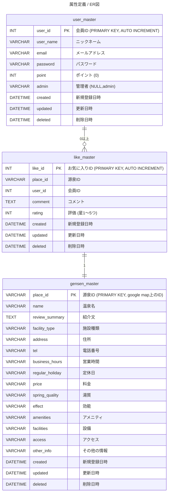

# 「源泉しか勝たん」ER図

```mermaid
---
title: "属性定義 / ER図"
---
erDiagram
    gensen_master {
        VARCHAR place_id PK "源泉ID (PRIMARY KEY, google map上のID)"
        VARCHAR name "温泉名"
        TEXT review_summary "紹介文"
        VARCHAR facility_type "施設種類"
        VARCHAR address "住所"
        VARCHAR tel "電話番号"
        VARCHAR business_hours "営業時間"
        VARCHAR regular_holiday "定休日"
        VARCHAR price "料金"
        VARCHAR spring_quality "湯質"
        VARCHAR effect "効能"
        VARCHAR amenities "アメニティ"
        VARCHAR facilities "設備"
        VARCHAR access "アクセス"
        VARCHAR other_info "その他の情報"
        DATETIME created "新規登録日時"
        DATETIME updated "更新日時"
        DATETIME deleted "削除日時"
    }

    user_master ||--o{ like_master : "0以上"
    like_master ||--|| gensen_master : "1"

    user_master {
        INT user_id PK "会員ID (PRIMARY KEY, AUTO INCREMENT)"
        VARCHAR user_name "ニックネーム"
        VARCHAR email "メールアドレス"
        VARCHAR password "パスワード"
        INT point "ポイント (0)"
        VARCHAR admin "管理者 (NULL,admin)"
        DATETIME created "新規登録日時"
        DATETIME updated "更新日時"
        DATETIME deleted "削除日時"
    }

    like_master {
        INT like_id PK "お気に入りID (PRIMARY KEY, AUTO INCREMENT)"
        VARCHAR place_id "源泉ID"
        INT user_id "会員ID"
        TEXT comment "コメント"
        INT rating "評価 (星1～5つ)"
        DATETIME created "新規登録日時"
        DATETIME updated "更新日時"
        DATETIME deleted "削除日時"
    }

```

